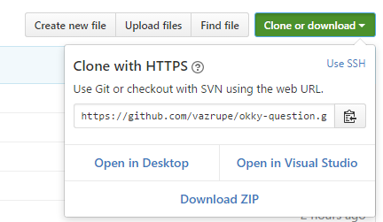

# 개요
OKKY에서 본 신입(?) 문제를 python3로 풀어봤습니다.

6시간 정도 걸린듯 하네요 ㅎㅎ..

문제 출처 : [#1](http://okky.kr/article/373177), [#2](http://okky.kr/article/302445)

## 작성 환경
| 이름 | 스펙 |
| --- | --- |
| OS | Windows 10 Home|
| CPU | Intel Core i5-6600 3.30GHz (use 1 Core) |
| Memory | 16G |
| Python Version | 3.4.3 (on Cygwin64) |

## 저장소 복제하기
```
$ git clone https://github.com/vazrupe/okky-question
$ cd okky-question
```
혹은



상단 우측의 `Clone or download > Download ZIP`을 눌러도 됩니다.

## 단위 테스트
```
okky-question$ py.test
```

## 성능 테스트
```
okky-question$ python3 perf-q1.py
okky-question$ python3 perf-q2.py
okky-question$ python3 perf-q3.py
```
성능 테스트는 1~3번 문제만 했습니다. 4, 5번 문제는 성능이 유의미하지 않습니다.